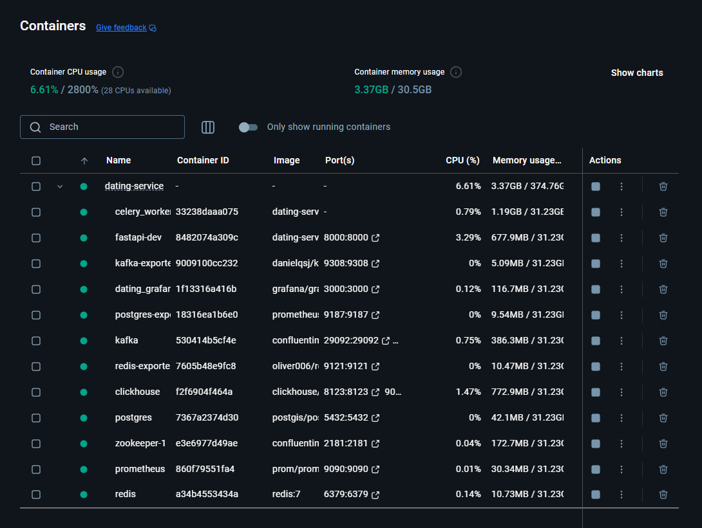
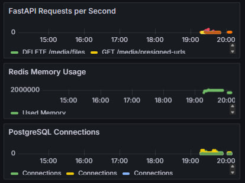
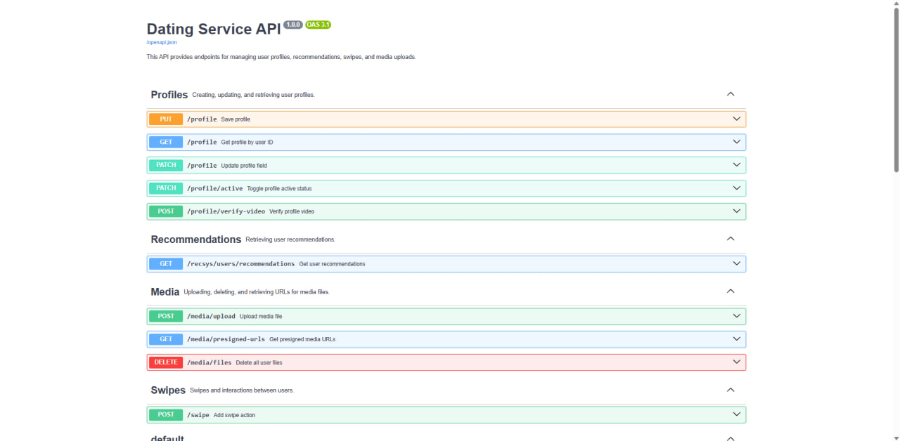
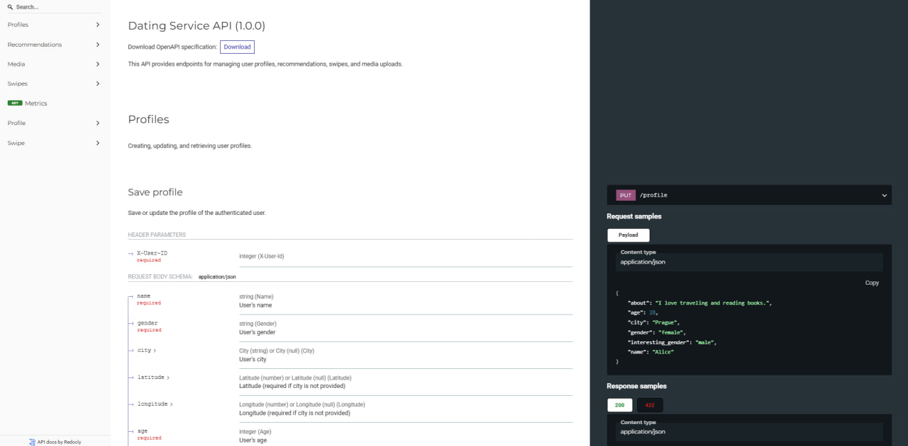
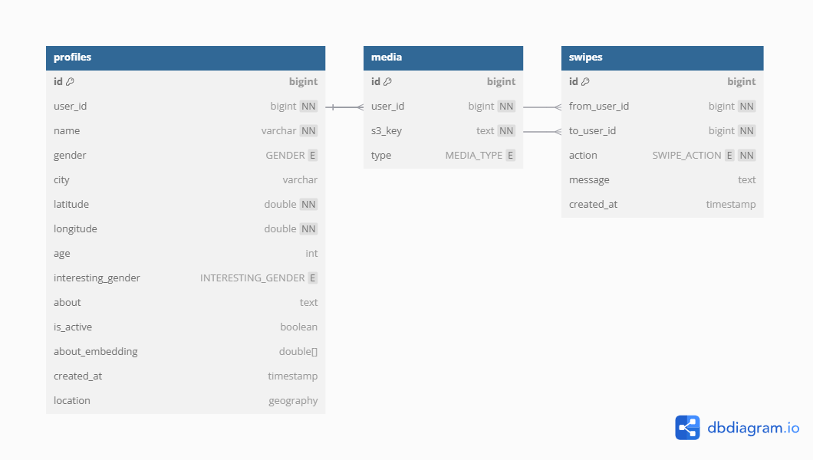
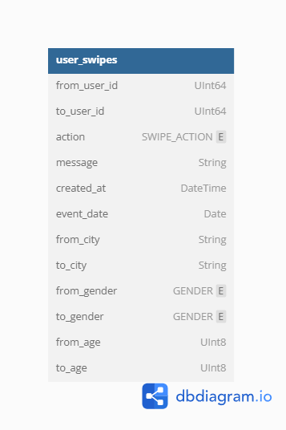
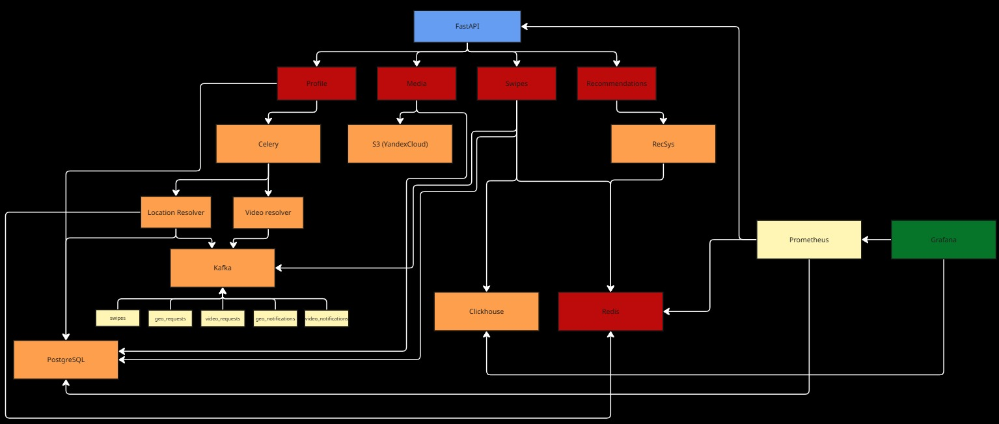

# ZeeMe
**ZeeMe** - is a dating service API, with an implementation using Telegram Bot API.

## Developer`s team
- **Ivan Lyapin** - team lead of the project, full-stack developer, is responsible for: RecSys, PostgreSQL, ClickHouse, Grafana, FastAPI, tg bot and docs.
- **Vladislav Polezhaev** - full-stack developer, is responsible for Kafka, Celery, Redis, S3, FastAPI, tg bot.

## How to run project
- Clone this repository and fill out the .env file according to the sample:
```
# postgre
POSTGRES_DB=... 
POSTGRES_USER=...
POSTGRES_PASSWORD=...
DB_HOST=...
DB_PORT=...

# redis
REDIS_HOST=...
REDIS_EXTERNAL_HOST=...
REDIS_PORT=...
REDIS_FSM=...
REDIS_FASTAPI_CACHE=...
REDIS_CELERY=...
REDIS_LIMITER=...

# bot
BOT_TOKEN=...

# s3
S3_ENDPOINT_URL=...
S3_REGION_NAME=...
S3_BUCKET_NAME=...
S3_ACCESS_KEY_ID=...
S3_SECRET_ACCESS_KEY=...

# clickhouse
CLICKHOUSE_HOST=...
CLICKHOUSE_PORT=...
CLICKHOUSE_DB=...
CLICKHOUSE_USER=...
CLICKHOUSE_PASSWORD=...

# kafka
KAFKA_HOST=...
KAFKA_EXTERNAL_HOST=...
KAFKA_PORT=...
KAFKA_EXTERNAL_PORT=...
KAFKA_SWIPES_TOPIC=...
KAFKA_GEO_TOPIC=...
KAFKA_VIDEO_TOPIC=...
KAFKA_GEO_NOTIFICATIONS_TOPIC=...
KAFKA_VIDEO_NOTIFICATIONS_TOPIC=...

# grafana
GRAFANA_PORT=...
GRAFANA_PASSWORD=...

# fastapi
FASTAPI_PORT=...

# api
API_URL=...
API_SECRET_KEY=...
```
- After that you can run project by execution ./start.sh in terminal (-dev/-prod mode).
```
#!/bin/bash

set -e

ENV=${1:-dev}

case "$ENV" in
  dev)
    echo "Starting in DEV mode..."
    docker compose up --build
    ;;
  prod)
    echo "Starting in PROD mode..."
    docker compose -f docker-compose.yml -f docker-compose.prod.yml up --build -d
    ;;
  *)
    echo "Unknown mode: $ENV"
    echo "Usage: ./start.sh [dev|prod]"
    exit 1
    ;;
esac

```
- Then launch tg bot in case you want to check performance by using tg bot API.

### Docker containers


## Monitoring
Some of the metric`s you can monitor in Grafana (FastAPI, Redis, postgres + ClickHouse dashboards)


## Swagger
FastAPI swagger you can check on `http://{HOST}:{FASTAPI_PORT}/docs`, `http://{HOST}:{FASTAPI_PORT}/redoc`

- docs:


- redocs:


### PostgreSQL scheme


### ClickHouse scheme


### FastAPI scheme



